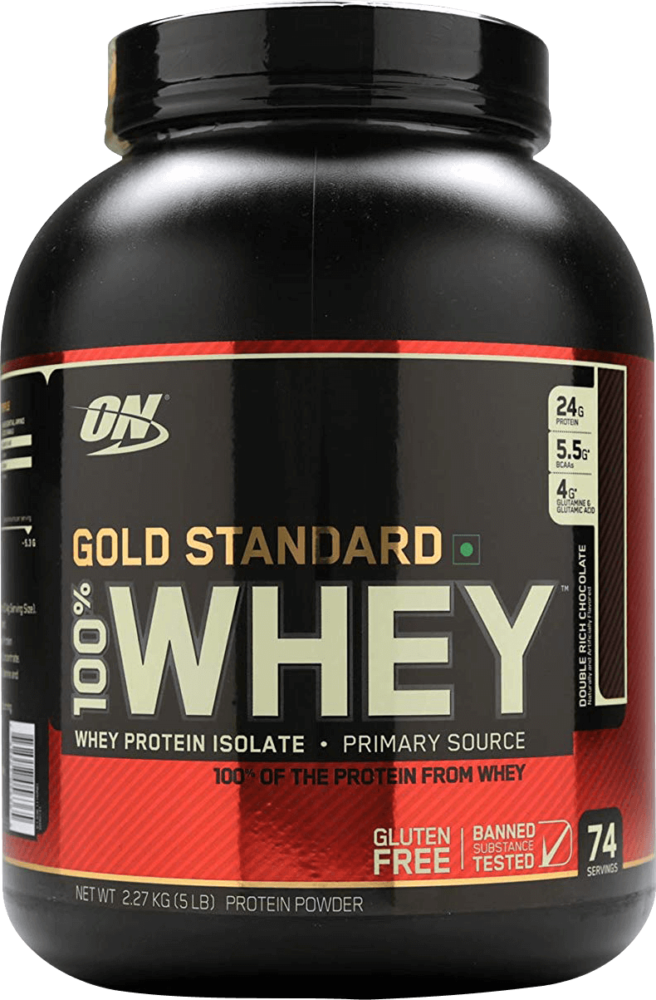
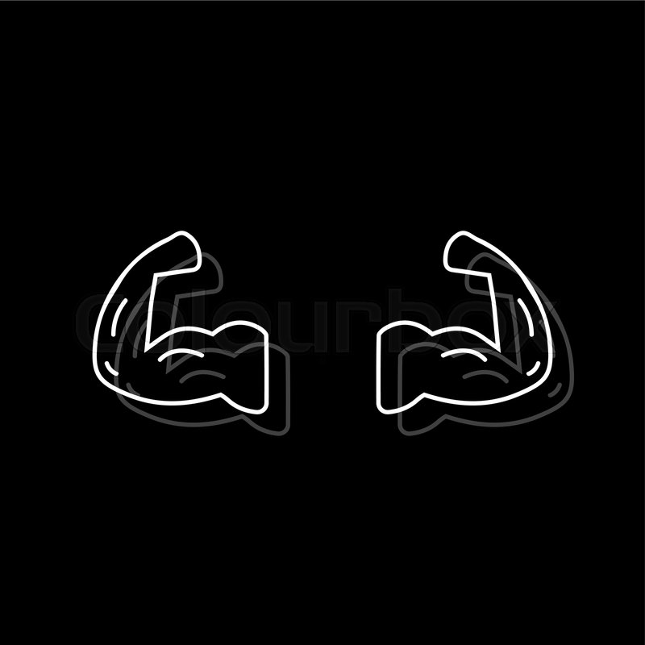

<!DOCTYPE html>
<html lang="en">

<head>
    <meta charset="UTF-8">
    <meta name="viewport" content="width=device-width, initial-scale=1.0">
    <title>WE GYM</title>

    <link rel="shortcut icon" href="https://w7.pngwing.com/pngs/150/327/png-transparent-dumbbell-weight-training-exercise-physical-fitness-olympic-weightlifting-dumbbell-angle-text-rectangle.png">

    
    <link href="https://fonts.googleapis.com/css2?family=Big+Shoulders+Stencil+Text:wght@600&display=swap" rel="stylesheet">
    <link href="https://fonts.googleapis.com/css2?family=Big+Shoulders+Stencil+Text:wght@300;900&display=swap" rel="stylesheet">
    <link href="https://fonts.googleapis.com/css2?family=Syne+Mono&display=swap" rel="stylesheet">
    
    <link rel="stylesheet" href="https://cdnjs.cloudflare.com/ajax/libs/font-awesome/4.7.0/css/font-awesome.min.css">
    <link rel="stylesheet" href="https://stackpath.bootstrapcdn.com/bootstrap/4.4.1/css/bootstrap.min.css" integrity="sha384-Vkoo8x4CGsO3+Hhxv8T/Q5PaXtkKtu6ug5TOeNV6gBiFeWPGFN9MuhOf23Q9Ifjh" crossorigin="anonymous">
    <link rel="stylesheet" href="main.css">
    
    
    
    
</head>

<body>

    

        

            

                <button id="adver_btn" class="btn btn-danger">CLICK ME!!!</button>
                

                    

                     

                        

                            
@zhanysbayev

                         

                         <button id="inst_btn">instagram</button>
                         <button id="stop">stop</button>
                     

     
                        

                           <h3 id="prod_h">Protein.</h3>
                           
The best way to be stronger.

                         

     
                         

                           
                         

     

                         

                        <button id="slide_btn" class="btn btn-success">Buy now</button>
                        

     
                        

                            
If u have qs call this num  8-776-161-05-12

                        

                          

     
                     

     
                 

                 
            

        

        &#9776;

       

       

        
        
John

    

           
 

         X

           <a href="#header" id="home">Home</a>
           <a href="#mid" id="about" >About</a>
           <a href="#page3" id="class">Classes</a>
           <a href="#page4" id="schedule">Schedule</a>
           <a href="#location_page" id="contact">Location</a>
           
           <a href="#" id="less" onclick= "openInNewTab()"> Online </a>
           <button id="but" onclick="popup()">SIGN UP</button>
           
 

    
 

    

        
Work harder, get stronger

        <h1 id="h11">EASY WITH OUR GYM</h1>

            

               <a href="#mid" class="bt" id="bt">READ MORE</a>
               <button class="bt" id="bt2" onclick="popup2()">LOG IN</button>
            

            

                

                    
                    
                    <input id="username2" type="text" name="username" placeholder="Username" >
                    <input type="password" id="pass" name="pass" placeholder="Password" >
                    <button onclick="login(username2.value)" class="btn btn-outline-dark">Log In</button>
                

            

    

    

        

            
            
            <h3 id="registr_h">Register</h3>
            
Create your account. It's free and takes a minute

                    
            

            <form class="needs-validation">

                

                    <input id="first_name" type="text" name="name" placeholder="First Name" required >
                    <input id="last_name" type="text" name="name" placeholder="Last Name" required >
                 

                

                    <input type="date" id="birthday" name="birthday" min="2000-01-02" required >
                

                

                    <input type="number" id="age" name="age" min="15" max="99"placeholder="Age" required >
                

                

                    <select id="cities" name="city">
                        <option value="kz" selected>Kazakhstan</option>
                        <option value="ru">Russia</option>
                        <option value="usa">USA</option>
                    </select>  
                

                

                    <input type="radio" id="male" name="gender" value="male">
                    <label for="male">Male</label> 
                    <input type="radio" id="female" name="gender" value="female">
                    <label for="female">Female</label> 
                

                

                    <input type="email" id="email" name="email" placeholder="Email" required >
                

                

                    <input type="password" id="pwd" name="pwd" placeholder="Password" required >
                

                

                    <input type="checkbox" id="accept" name="" value="" checked>
                    <label for="accept"> I accept the Terms of Use & Privacy Policy.</label>
                

                

                    <button id="btn_suc" class="btn btn-success" onclick="login(email.value)">Register Now</button>
                

            </form>
            

        

        
    

    
        
   

    

        

        <h2 id="mid_h2">ABOUT US</h2>
        
Training studio is free CSS template for gyms amd fitness centers. U r   allowed to use
        this layout for ur business website 

        

        

        

            

                
            

            

                <h1>Basic Fitness</h1>
                
You’ll train all major bodyparts in each workout (as opposed to “splitting up” your training). Train three days this first week, performing just one exercise per bodypart in each session.
                     <a class="discover1" href="https://www.muscleandfitness.com/workout-plan/workouts/workout-routines/complete-mf-beginners-training-guide-plan/">Discover more</a> 
                

            

        

        

            

                
            

            

                <h1>Basic Muscle Course</h1>
                
Each goal involves lifting heavy things and eating the right foods, but the details are a little bit different. Here’s a primer to maximize your desired results.
                     <a class="discover2" href="https://www.mensjournal.com/health-fitness/how-build-muscle-basic-guide-beginners-0/">Discover more</a> 
                

            

        

        
        

        

        

            

                
            

            

                <h1>New Gym Training</h1>
                
This workout isn’t too difficult; though, for those new to health and fitness, it will certainly prove challenging. First of all you should pass Basic Fitness Course.
                     <a class="discover3" href="https://www.lifehack.org/688549/the-ultimate-workout-routines-for-men">Discover more</a>   
                

            

        

        

            

                
            

            

                <h1>Yoga Training</h1>
                
So, you’re practicing yoga and feeling the amazing changes that it brings.  You’re part of an great community of people and feeling stronger, more flexible and centered.
                     <a class="discover4" href="https://feelbetteryoga.com/blog/yoga-teacher-training-guide">Discover more</a>   
                

            

        

        
        

        

            

    
                

                    
                

    
                

                    <h1>New Gym Training</h1>
                    
Lorem ipsum dolor sit amet consectetur adipisicing elit. 
                        Incidunt accusantium perspiciatis, voluptas explicabo unde praesentium 
                         <a class="discover4" href="https://feelbetteryoga.com/blog/yoga-teacher-training-guide">Discover more</a>  

                        
                

    
            

    
    
            

    
                

                    
                

    
                

                    <h1>Yoga Training</h1>
                    
Lorem ipsum dolor sit amet consectetur adipisicing elit. 
                        Incidunt accusantium perspiciatis, voluptas explicabo unde praesentium 
                         <a class="discover4" href="https://feelbetteryoga.com/blog/yoga-teacher-training-guide">Discover more</a> 

                     
                

    
            

            
            

            

                
            

    
    

    

        

            

            

                <h1 id="third_h">DON'T THINK,
                BEGIN TODAY!</h1>
                
Lorem ipsum dolor sit amet consectetur adipisicing elit.

            

        
 

        

            

                
 &#9758; First Training Class 

                
 &#9758; Second Training Class 

                
 &#9758; Third Training Class 

                
 &#9758; Fourth Training Class 

                
 &#9758; Fifth Training Class 

            

            

                

                    
                

               
                

                    <h4 id="title">First Training Class</h4>
                

                

                    
Group training(Stretching, Aerobic Training, Mixed Training, Dancing)

                

                

                    <a href="#page4" class="w3-btn w3-black" id="card_btn">VIEW SCHEDULE</a>
                

            

            

                

                    
                

                

                    <h4 id="title">Second Training Class</h4>
                

                

                    
Arm Day(Exercises For Biceps, Triceps, Shoulders, Chest)

                

                

                    <a href="#page4" class="w3-btn w3-black" id="card_btn">VIEW SCHEDULE</a>
                

            

            

                

                    
                

                

                    <h4 id="title">Third Training Class</h4>
                

                

                    
Leg Day(Lunges, Squats, Deadlifts, Jumping Rope, Calf Raises)

                

                

                    <a href="#page4" class="w3-btn w3-black" id="card_btn">VIEW SCHEDULE</a>
                

            

            

                

                    
                

                

                    <h4 id="title">Fourth Training Class</h4>
                

                

                    
Exercise With A Lot Of Weight(Bench Press, Deadlift, Squats)

                

                

                    <a href="#page4" class="w3-btn w3-black" id="card_btn">VIEW SCHEDULE</a>
                

            

            

                

                    
                

                

                    <h4 id="title">Fifth Training Class</h4>
                

                

                    
Cardio Training(Treadmill, Stepper, Exercise Bike, Ellipsoid, Rowing Msachines

                

                

                    <a href="#page4" class="w3-btn w3-black" id="card_btn">VIEW SCHEDULE</a>
                

            

   
           

        

    

    

        

            <h1>CLASSES SCHEDULE </h1>
            
Lorem ipsum dolor sit amet consectetur, adipisicing elit.  
                Nesciunt excepturi quia corporis architecto iusto porro sint cupiditate iure consequuntur

        

        

            <a href="#page4" id="m" onclick="change_content(this)">Monday</a> 
            <a href="#page4" id="tu" onclick="change_content(this)">Tuesday</a> 
            <a href="#page4" id="w" onclick="change_content(this)">Wednesday</a>
            <a href="#page4" id="th" onclick="change_content(this)">Thursday</a>
            <a href="#page4" id="fr" onclick="change_content(this)">Friday</a>
        

        

            <table border="5">
                <tr>
                    <td class="td"  id="td">First Class</td>
                    <td class="td"  id="td1">10:00AM - 11:30AM</td>
                    <td class="td"  id="td2"></td>
                    <td class="td"  id="td3">N.Ergaliyev</td>
                </tr>
                <tr>
                    <td class="td"  id="td">Second Class</td>
                    <td class="td"  id="td4"></td>
                    <td class="td"  id="td5"></td>
                    <td class="td"  id="td6">E.Kim</td>
                </tr>
                <tr>
                    <td class="td"  id="td">Third Class</td>
                    <td class="td"  id="td7"></td>
                    <td class="td"  id="td8">2:00AM - 3:30AM</td>
                    <td class="td"  id="td9">A.Abdykerov</td>
                </tr>
                <tr>
                    <td class="td"  id="td">Fourth Class</td>
                    <td class="td"  id="td10"></td>
                    <td class="td"  id="td11"></td>
                    <td class="td"  id="td12">N.Imashev</td>
                </tr>
                <tr>
                    <td class="td"  id="td">Fifth Class</td>
                    <td class="td"  id="td13"></td>
                    <td class="td"  id="td14"></td>
                    <td class="td"  id="td15">A.Batyrov</td>
                </tr>
                
            </table>
        

    

    

    

    

        

            <h3>LOCATIONS</h3>
        

    
        

        

            

                
            

            

                <h6>WeGym, Kutuzovski</h6>  
                
 <spann style="color: rgb(155, 155, 155);"> &#xf08d;</spann> Russia, Moscow, Davydkovskaya Street, 3c1 
 
                
 <spann style="color: rgb(155, 155, 155);"> &#xf017;</spann>  Opens at <b>06.30 AM - 00.00 AM</b>
 
                <a href="https://yandex.kz/maps/213/moscow/?filter=alternate_vertical%3ARequestWindow&ll=37.687324%2C55.755087&mode=search&oid=1367518322&ol=biz&sctx=ZAAAAAgBEAAaKAoSCfGQUp6zxEJAETNTGGP530tAEhIJRPRIfeduiD8R7f4uEyuccD8oCkC3ngFIAVXNzMw%2BWABiTXJlYXJyPXNjaGVtZV9Mb2NhbC9HZW8vUGVyc29uYWxTY29yZS9TY29yZUZlYXR1cmVOYW1lPWZpbmFsX3Njb3JlX3JhdGVfaXNfeDIwYjRyZWFycj1zY2hlbWVfTG9jYWwvR2VvL1JlYXJyYW5nZVJ1YnJpY0J5L1R5cGU9UFNjb3JlYjByZWFycj1zY2hlbWVfTG9jYWwvR2VvL1JlYXJyYW5nZVJ1YnJpY0J5L0Vhcmx5PTBiLnJlYXJyPXNjaGVtZV9Mb2NhbC9HZW8vUGVyc29uYWxTY29yZS9FbmFibGVkPTFiOnJlYXJyPXNjaGVtZV9Mb2NhbC9HZW8vUmVhcnJhbmdlUnVicmljQnkvRHNzbVRocmVzaG9sZD0wLjdqAmt6cACdAc3MTD2gAQCoAQC9AR%2FpuIPCAYoB8tiKjAW%2F0rPqA4qNrKGpBMn8pZQEoc2C2AT4u%2Bf%2B9QWv%2FaqE8gLGna%2BGfZ2RucG3AsizqY8E2qviwAbpn9bD3AOj2ZGFB6n7uKKaAbP%2B5IgEhLSqv5IEpPqu184EkMOLg5cFlr6WkASqmZibrgHejoOaoAKn7d6l0Qadi4DQygPL25y%2FBtL4v7IE&sll=37.687324%2C55.755087&sspn=0.742659%2C0.252401&text=gym&z=10.96" id="map_btn">GET DIRECTION</a>
            

        

    
        

            

                
            

            

                <h6>WeGym, Green</h6>  
                
 <spann style="color: rgb(155, 155, 155);"> &#xf08d;</spann>  Russia, Moscow, 1st Perova Polya Drive, 9c2
 
                
 <spann style="color: rgb(155, 155, 155);"> &#xf017;</spann>  Opens at <b>06.30 AM - 00.00 AM</b>
  
                <a href="https://yandex.kz/maps/213/moscow/?filter=alternate_vertical%3ARequestWindow&ll=37.687324%2C55.755087&mode=search&oid=1028450623&ol=biz&sctx=ZAAAAAgBEAAaKAoSCfGQUp6zxEJAETNTGGP530tAEhIJRPRIfeduiD8R7f4uEyuccD8oCkC3ngFIAVXNzMw%2BWABiTXJlYXJyPXNjaGVtZV9Mb2NhbC9HZW8vUGVyc29uYWxTY29yZS9TY29yZUZlYXR1cmVOYW1lPWZpbmFsX3Njb3JlX3JhdGVfaXNfeDIwYjRyZWFycj1zY2hlbWVfTG9jYWwvR2VvL1JlYXJyYW5nZVJ1YnJpY0J5L1R5cGU9UFNjb3JlYjByZWFycj1zY2hlbWVfTG9jYWwvR2VvL1JlYXJyYW5nZVJ1YnJpY0J5L0Vhcmx5PTBiLnJlYXJyPXNjaGVtZV9Mb2NhbC9HZW8vUGVyc29uYWxTY29yZS9FbmFibGVkPTFiOnJlYXJyPXNjaGVtZV9Mb2NhbC9HZW8vUmVhcnJhbmdlUnVicmljQnkvRHNzbVRocmVzaG9sZD0wLjdqAmt6cACdAc3MTD2gAQCoAQC9AR%2FpuIPCAYoB8tiKjAW%2F0rPqA4qNrKGpBMn8pZQEoc2C2AT4u%2Bf%2B9QWv%2FaqE8gLGna%2BGfZ2RucG3AsizqY8E2qviwAbpn9bD3AOj2ZGFB6n7uKKaAbP%2B5IgEhLSqv5IEpPqu184EkMOLg5cFlr6WkASqmZibrgHejoOaoAKn7d6l0Qadi4DQygPL25y%2FBtL4v7IE&sll=37.687324%2C55.755087&sspn=0.742659%2C0.252401&text=gym&z=10.96" id="map_btn">GET DIRECTION</a>
            

        

        

        

    

    

        
        

       
            

            

                

                    <h5>LINKS</h5>
                

                

                    <a href="#header">Homepage</a>
                    <a href="#mid">About us</a>
                    <a href="#page3">Classes</a>
                    <a href="#page4">Scedule</a>
                    <a href="#location_page">Location</a>
                    <a href="#" onclick="openInNewTab()">Online</a>
                

            

            

                

                    <h5>CONTACTS</h5>
                

                

                    
&#xf015; Addressssss

                    
&#xf003; Hello@couvee.co.id

                    
&#xf095; Phone num

                

            

            

                

                    <h5>SOCIALS</h5>
                

                

                    <a href="https://www.instagram.com/couvee.idn/" class="fa">&#xf16d; couvee.idn</a>
                

            

        

    

    

        

            
© 2019 Couvee

        

        
    

    
    

     

</body>
</html>
